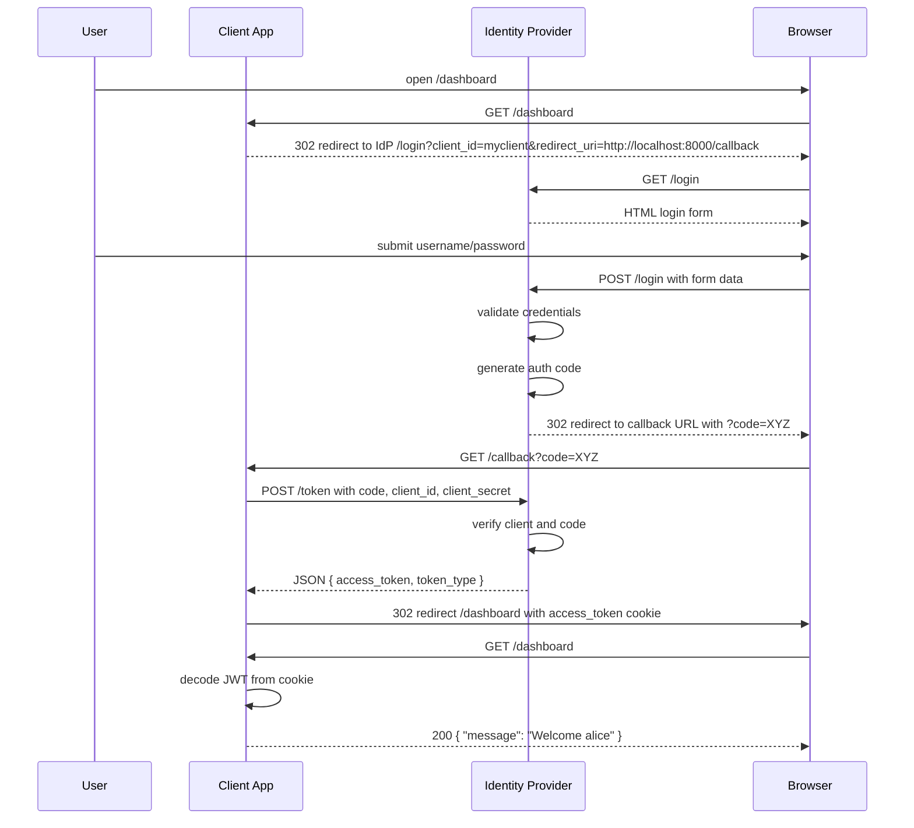

```mermaid
sequenceDiagram
    participant User
    participant ClientApp as Client App
    participant IdP as Identity Provider
    participant Browser

    User->>Browser: open /dashboard
    Browser->>ClientApp: GET /dashboard
    ClientApp-->>Browser: 302 redirect to IdP /login?client_id=myclient&redirect_uri=http://localhost:8000/callback

    Browser->>IdP: GET /login
    IdP-->>Browser: HTML login form

    User->>Browser: submit username/password
    Browser->>IdP: POST /login with form data
    IdP->>IdP: validate credentials
    IdP->>IdP: generate auth code
    IdP-->>Browser: 302 redirect to callback URL with ?code=XYZ

    Browser->>ClientApp: GET /callback?code=XYZ
    ClientApp->>IdP: POST /token with code, client_id, client_secret
    IdP->>IdP: verify client and code
    IdP-->>ClientApp: JSON { access_token, token_type }

    ClientApp->>Browser: 302 redirect /dashboard with access_token cookie
    Browser->>ClientApp: GET /dashboard
    ClientApp->>ClientApp: decode JWT from cookie
    ClientApp-->>Browser: 200 { "message": "Welcome alice" }
```